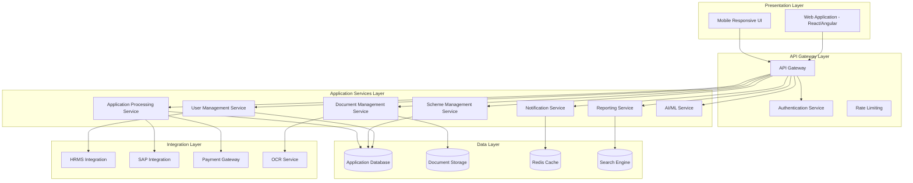

# Design Document: LTET Employee Trust Portal

## Overview

The L&T Employee Trust (LTET) Digital Portal is a comprehensive web-based platform designed to modernize the administration of 14 employee welfare schemes across Medical, Education, and Skill building categories. The system serves approximately 600,000 beneficiaries including current employees, retirees, and their dependents across all L&T Independent Companies (ICs).

The platform replaces legacy systems with a centralized, role-based digital ecosystem that supports transparent application workflows, automated processing, real-time tracking, and comprehensive reporting capabilities. The architecture follows modern enterprise patterns with microservices design, API-first approach, and cloud-native deployment strategies.

## Architecture

### High-Level Architecture

The LTET portal follows a layered microservices architecture with clear separation of concerns:



### Service Architecture Principles

**Domain-Driven Design**: Each microservice is organized around specific business domains (User Management, Scheme Processing, Document Handling) with clear bounded contexts and minimal cross-service dependencies.

**API-First Design**: All services expose well-defined REST APIs with OpenAPI/Swagger documentation, enabling independent development and testing of frontend and backend components.

**Event-Driven Communication**: Services communicate through asynchronous events for non-critical operations (notifications, audit logging) while maintaining synchronous APIs for real-time user interactions.

**Scalability Patterns**: Each service can be scaled independently based on load patterns, with auto-scaling policies configured for peak usage periods during scheme application deadlines.

## Components and Interfaces

### Core Application Services

#### User Management Service
**Responsibilities**: Authentication, authorization, profile management, role-based access control
**Key APIs**:
- `POST /auth/login` - User authentication with credential validation
- `GET /users/{id}/profile` - Retrieve user profile with HRMS synchronization
- `PUT /users/{id}/profile` - Update profile information with validation
- `GET /users/{id}/permissions` - Retrieve role-based permissions matrix

**Integration Points**: HRMS for employee data synchronization, Active Directory for authentication

#### Scheme Management Service
**Responsibilities**: Scheme configuration, eligibility rules, content management
**Key APIs**:
- `GET /schemes` - List available schemes with eligibility filtering
- `POST /schemes` - Create new scheme configuration (Admin only)
- `GET /schemes/{id}/eligibility/{userId}` - Check user eligibility for specific scheme
- `PUT /schemes/{id}/rules` - Update eligibility rules and validation criteria

**Business Logic**: Rule engine for dynamic eligibility calculation, content versioning for scheme updates

#### Application Processing Service
**Responsibilities**: Application lifecycle management, workflow orchestration, approval routing
**Key APIs**:
- `POST /applications` - Submit new scheme application
- `GET /applications/{id}/status` - Retrieve application status and timeline
- `PUT /applications/{id}/approve` - Approve application (Approver role)
- `POST /applications/{id}/clarification` - Request clarification from applicant

**Workflow Engine**: State machine implementation for application status transitions, SLA tracking with automated escalation

#### Document Management Service
**Responsibilities**: File upload, validation, OCR processing, version control
**Key APIs**:
- `POST /documents/upload` - Upload documents with validation
- `GET /documents/{id}` - Retrieve document with access control
- `POST /documents/{id}/validate` - Trigger OCR validation process
- `GET /documents/{id}/versions` - Retrieve document version history

**Storage Strategy**: Cloud-based object storage with CDN for performance, encryption at rest and in transit

#### Notification Service
**Responsibilities**: Multi-channel notifications, preference management, delivery tracking
**Key APIs**:
- `POST /notifications/send` - Send notification via configured channels
- `GET /notifications/{userId}` - Retrieve user notification history
- `PUT /notifications/preferences` - Update notification preferences
- `POST /notifications/bulk` - Send bulk notifications for announcements

**Delivery Channels**: Email, SMS, in-app notifications with fallback mechanisms and delivery confirmation

### Integration Interfaces

#### HRMS Integration
**Purpose**: Employee data synchronization, service validation, organizational hierarchy
**Integration Pattern**: Scheduled batch synchronization with real-time lookup capabilities
**Data Flow**: Employee master data, department information, service records, retirement status

#### SAP Integration
**Purpose**: Financial processing, payment reconciliation, budget tracking
**Integration Pattern**: Event-driven integration with secure API communication
**Data Flow**: Approved claims, payment instructions, reconciliation reports, budget utilization

#### Payment Gateway Integration
**Purpose**: Bank validation, payment processing, transaction status tracking
**Integration Pattern**: Synchronous API calls with retry mechanisms and failure handling
**Data Flow**: Bank account validation, payment instructions, transaction confirmations, failure notifications

## Data Models

### Core Entities

#### User Entity
```json
{
  "userId": "string",
  "employeeId": "string",
  "personalInfo": {
    "name": "string",
    "email": "string",
    "phone": "string",
    "address": "object"
  },
  "employmentInfo": {
    "department": "string",
    "ic": "string",
    "joiningDate": "date",
    "retirementDate": "date",
    "status": "active|retired"
  },
  "bankDetails": {
    "accountNumber": "string",
    "ifscCode": "string",
    "bankName": "string"
  },
  "dependents": [
    {
      "name": "string",
      "relationship": "string",
      "dateOfBirth": "date",
      "documents": ["documentId"]
    }
  ],
  "roles": ["employee|approver|finance|admin|head|system_admin"],
  "createdAt": "timestamp",
  "updatedAt": "timestamp"
}
```

#### Scheme Entity
```json
{
  "schemeId": "string",
  "name": "string",
  "category": "medical|education|skill_building",
  "description": "string",
  "eligibilityRules": {
    "serviceYears": "number",
    "salaryRange": "object",
    "dependentAge": "number",
    "icRestrictions": ["string"]
  },
  "documentRequirements": [
    {
      "type": "string",
      "mandatory": "boolean",
      "validationRules": "object"
    }
  ],
  "approvalWorkflow": {
    "levels": ["string"],
    "slaHours": "number",
    "escalationRules": "object"
  },
  "budgetInfo": {
    "maxAmount": "number",
    "fiscalYear": "string",
    "utilizationLimit": "number"
  },
  "status": "active|inactive|draft",
  "validFrom": "date",
  "validTo": "date"
}
```

#### Application Entity
```json
{
  "applicationId": "string",
  "userId": "string",
  "schemeId": "string",
  "applicationData": {
    "claimAmount": "number",
    "purpose": "string",
    "beneficiary": "string",
    "customFields": "object"
  },
  "documents": [
    {
      "documentId": "string",
      "type": "string",
      "uploadedAt": "timestamp",
      "validationStatus": "pending|validated|failed"
    }
  ],
  "workflow": {
    "currentStatus": "draft|submitted|under_review|approved|rejected|disbursed",
    "approvalHistory": [
      {
        "approverId": "string",
        "action": "approve|reject|clarify",
        "comments": "string",
        "timestamp": "timestamp"
      }
    ],
    "slaDeadline": "timestamp",
    "escalationLevel": "number"
  },
  "paymentInfo": {
    "approvedAmount": "number",
    "paymentStatus": "pending|processed|failed",
    "transactionId": "string",
    "processedAt": "timestamp"
  },
  "auditTrail": [
    {
      "action": "string",
      "userId": "string",
      "timestamp": "timestamp",
      "details": "object"
    }
  ]
}
```

### Data Relationships

**User-Application Relationship**: One-to-many relationship where each user can have multiple applications across different schemes, with foreign key constraints ensuring data integrity.

**Scheme-Application Relationship**: One-to-many relationship linking applications to their respective schemes, enabling scheme-specific validation and processing rules.

**Document-Application Relationship**: Many-to-many relationship allowing multiple documents per application and supporting document reuse across applications where applicable.

**Approval Workflow Relationship**: Hierarchical relationship supporting multi-level approvals with configurable routing based on scheme type, amount thresholds, and organizational structure.

## Correctness Properties

*A property is a characteristic or behavior that should hold true across all valid executions of a system—essentially, a formal statement about what the system should do. Properties serve as the bridge between human-readable specifications and machine-verifiable correctness guarantees.*

Based on the prework analysis of acceptance criteria, the following properties have been identified as testable through property-based testing. These properties focus on core system behaviors that should hold universally across all valid inputs and scenarios.

### Authentication and Access Control Properties

**Property 1: Valid Authentication Success**
*For any* valid user credentials, authentication should succeed and grant appropriate role-based access permissions
**Validates: Requirements 1.1**

**Property 2: Account Lockout Consistency**
*For any* user account, three consecutive invalid login attempts should result in account lockout requiring OTP-based unlock
**Validates: Requirements 1.2**

**Property 3: Role-Based Access Enforcement**
*For any* user role assignment, the system should enforce access controls consistently across all modules and prevent unauthorized access
**Validates: Requirements 7.3, 11.2**

### Data Validation and Integrity Properties

**Property 4: Bank Account Validation**
*For any* bank account update, IFSC codes and account numbers should be validated according to standard banking formats
**Validates: Requirements 1.4, 6.2**

**Property 5: Document Format Validation**
*For any* document upload, the system should validate file formats (PDF, JPG, PNG), size limits (5MB), and completeness before acceptance
**Validates: Requirements 3.2, 3.6**

**Property 6: Password Policy Enforcement**
*For any* password submission, the system should enforce complexity requirements and reject non-compliant passwords
**Validates: Requirements 1.6**

### Application Workflow Properties

**Property 7: Eligibility Filtering Accuracy**
*For any* user and scheme combination, the scheme listing should display only schemes where the user meets all eligibility criteria
**Validates: Requirements 2.1**

**Property 8: Application Draft Persistence**
*For any* application in progress, saving draft data should preserve all entered information and allow complete resumption later
**Validates: Requirements 3.3**

**Property 9: Status Change Notification**
*For any* application status change, the system should update the timeline view and send notifications to the applicant through configured channels
**Validates: Requirements 4.1, 13.1**

**Property 10: SLA Escalation Automation**
*For any* application approaching SLA deadline, the system should automatically escalate to senior approvers and generate appropriate warnings
**Validates: Requirements 5.4, 4.3**

### Document Management Properties

**Property 11: Document Resubmission Integrity**
*For any* document resubmission request, the system should allow upload and processing without creating duplicate applications
**Validates: Requirements 4.5**

**Property 12: OCR Validation Consistency**
*For any* document upload, OCR processing should extract key fields and validate against application data with consistent accuracy
**Validates: Requirements 9.2**

### Financial Processing Properties

**Property 13: Payment Queue Integrity**
*For any* approved claim, the system should queue it for finance review with complete application details and maintain processing order
**Validates: Requirements 6.1**

**Property 14: Reconciliation Matching Accuracy**
*For any* bank reconciliation file import, the system should match transactions to claims and update statuses with 100% accuracy
**Validates: Requirements 6.4**

**Property 15: Payment Failure Recovery**
*For any* payment failure, the system should flag the transaction, preserve all data, and enable retry with updated details
**Validates: Requirements 6.5**

### System Integration Properties

**Property 16: HRMS Data Synchronization**
*For any* employee data change in HRMS, the system should synchronize updates within 24 hours through batch processing
**Validates: Requirements 10.1**

**Property 17: Integration Failure Handling**
*For any* integration failure, the system should log errors, attempt automatic retry, and escalate persistent issues appropriately
**Validates: Requirements 10.5**

### Audit and Compliance Properties

**Property 18: Audit Trail Completeness**
*For any* system action, complete audit trails should be maintained with user identification, timestamps, and action details
**Validates: Requirements 4.4, 7.6, 11.3**

**Property 19: Data Encryption Consistency**
*For any* data storage or transmission, AES-256 encryption at rest and TLS 1.2+ in transit should be enforced
**Validates: Requirements 11.1, 15.4**

### Performance and Scalability Properties

**Property 20: Response Time Maintenance**
*For any* user traffic increase, auto-scaling should maintain response times under 3 seconds
**Validates: Requirements 12.1**

**Property 21: Concurrent Access Support**
*For any* peak load scenario up to 10,000 concurrent users, the system should maintain functionality without performance degradation
**Validates: Requirements 12.2**

### Notification and Communication Properties

**Property 22: Deadline Reminder Accuracy**
*For any* scheme with approaching deadline, reminder notifications should be sent exactly 7 days, 3 days, and 1 day before closure
**Validates: Requirements 13.2**

**Property 23: Critical Alert Override**
*For any* critical alert, the system should override user notification preferences and ensure delivery through multiple channels
**Validates: Requirements 13.5**

### Accessibility and Responsiveness Properties

**Property 24: Responsive Layout Adaptation**
*For any* screen size from 320px to 1920px, the system should provide optimized layouts without functionality loss
**Validates: Requirements 14.1**

**Property 25: Keyboard Navigation Completeness**
*For any* system functionality, complete keyboard-only navigation should be supported without requiring mouse interaction
**Validates: Requirements 14.2**

### Backup and Recovery Properties

**Property 26: Backup Automation Reliability**
*For any* application data, automated daily backups should be performed with 30-day retention and integrity validation
**Validates: Requirements 15.1, 15.5**

**Property 27: Recovery Time Compliance**
*For any* system recovery scenario, point-in-time restoration should be completed within maximum 4-hour recovery time
**Validates: Requirements 15.3**

<function_calls>
<invoke name="prework">
<parameter name="featureName">ltet-employee-trust-portal

## Error Handling

### Error Classification and Response Strategy

The LTET system implements a comprehensive error handling strategy that categorizes errors by severity and provides appropriate user feedback and system recovery mechanisms.

#### User Input Validation Errors
**Scope**: Form validation, document upload, data entry errors
**Response Strategy**: 
- Immediate client-side validation with clear error messages
- Server-side validation as backup with detailed field-level feedback
- Progressive disclosure of validation rules to guide user correction
- Preservation of valid data during error correction

**Example Scenarios**:
- Invalid IFSC code format → Display format requirements and suggest corrections
- Oversized document upload → Show size limit and compression options
- Missing mandatory fields → Highlight required fields with contextual help

#### System Integration Errors
**Scope**: HRMS synchronization failures, SAP integration issues, payment gateway errors
**Response Strategy**:
- Automatic retry with exponential backoff for transient failures
- Circuit breaker pattern to prevent cascade failures
- Graceful degradation with cached data when possible
- Administrative alerts for persistent integration issues

**Recovery Mechanisms**:
- Queue-based retry for failed HRMS synchronization
- Manual reconciliation tools for payment processing failures
- Fallback to manual approval workflows when automation fails

#### Application Processing Errors
**Scope**: Workflow state inconsistencies, approval routing failures, SLA violations
**Response Strategy**:
- State machine validation to prevent invalid transitions
- Automatic escalation for stuck applications
- Administrative override capabilities for exceptional cases
- Comprehensive audit logging for troubleshooting

#### Security and Access Control Errors
**Scope**: Authentication failures, authorization violations, session management issues
**Response Strategy**:
- Progressive account lockout with clear unlock procedures
- Detailed security event logging without exposing sensitive information
- Automatic session termination for suspicious activities
- User-friendly error messages that don't reveal system internals

### Error Recovery and Resilience Patterns

**Database Transaction Management**: All critical operations use database transactions with rollback capabilities to maintain data consistency during failures.

**Idempotent Operations**: All API endpoints are designed to be idempotent, allowing safe retry of operations without side effects.

**Graceful Degradation**: Non-critical features (recommendations, analytics) degrade gracefully when dependencies are unavailable, maintaining core functionality.

**Circuit Breaker Implementation**: External service calls implement circuit breaker patterns to prevent system overload during downstream failures.

## Testing Strategy

### Dual Testing Approach

The LTET system employs a comprehensive testing strategy that combines traditional unit testing with property-based testing to ensure both specific functionality and universal correctness properties.

#### Unit Testing Strategy
**Scope**: Specific examples, edge cases, integration points, error conditions
**Coverage Areas**:
- API endpoint functionality with specific request/response scenarios
- Database operations with known data sets
- Authentication and authorization with predefined user roles
- Document validation with specific file types and sizes
- Payment processing with sample transaction data

**Testing Framework**: Jest for JavaScript/TypeScript components, JUnit for Java services
**Mock Strategy**: Minimal mocking focused on external dependencies (HRMS, SAP, payment gateways)
**Coverage Target**: 85% code coverage with focus on critical business logic paths

#### Property-Based Testing Strategy
**Scope**: Universal properties that should hold across all valid inputs
**Testing Framework**: fast-check for JavaScript/TypeScript, QuickCheck for functional components
**Test Configuration**: Minimum 100 iterations per property test to ensure comprehensive input coverage

**Property Test Categories**:
1. **Invariant Properties**: Data consistency after operations (user profile updates, application state changes)
2. **Round-trip Properties**: Serialization/deserialization, data export/import cycles
3. **Idempotence Properties**: Operations that should have same result when repeated (approval decisions, payment processing)
4. **Metamorphic Properties**: Relationships between inputs and outputs (filtered results are subsets of unfiltered)
5. **Error Condition Properties**: Invalid inputs should be rejected consistently

**Property Test Tagging**: Each property test includes comment tags referencing design document properties:
```javascript
// Feature: ltet-employee-trust-portal, Property 1: Valid Authentication Success
```

#### Integration Testing Strategy
**Scope**: End-to-end workflows, service interactions, external system integration
**Test Environment**: Dedicated UAT environment with mock external services
**Test Data Management**: Synthetic test data generation with realistic patterns
**Workflow Coverage**: Complete application lifecycle from submission to disbursement

#### Performance Testing Strategy
**Load Testing**: Gradual load increase to validate auto-scaling behavior
**Stress Testing**: Peak load scenarios with 10,000+ concurrent users
**Endurance Testing**: Extended operation periods to identify memory leaks
**Scalability Testing**: Validation of horizontal scaling capabilities

#### Security Testing Strategy
**Authentication Testing**: Multi-factor authentication, session management, password policies
**Authorization Testing**: Role-based access control across all user types
**Data Protection Testing**: Encryption validation, PII handling, audit trail integrity
**Penetration Testing**: Third-party security assessment of complete system

### Test Automation and Continuous Integration

**CI/CD Pipeline Integration**: All tests execute automatically on code commits with quality gates
**Test Reporting**: Comprehensive test reports with coverage metrics and property test results
**Failure Analysis**: Automated analysis of property test failures with counterexample preservation
**Performance Monitoring**: Continuous performance regression testing in staging environment

The testing strategy ensures that both specific functional requirements and universal system properties are validated, providing confidence in system correctness and reliability across all usage scenarios.